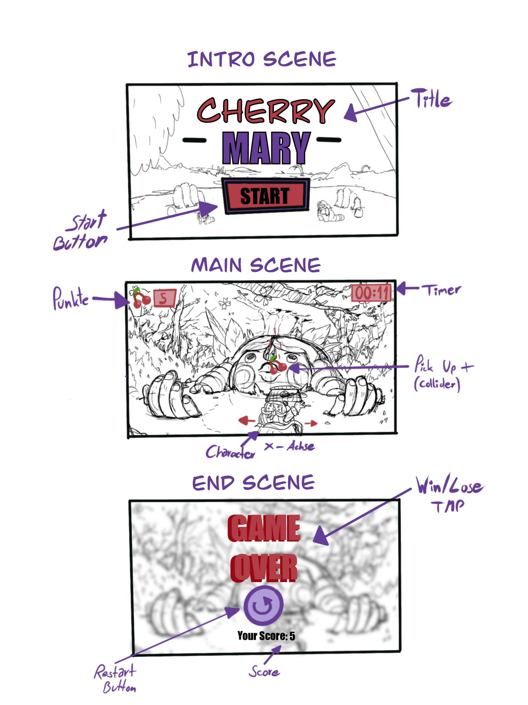
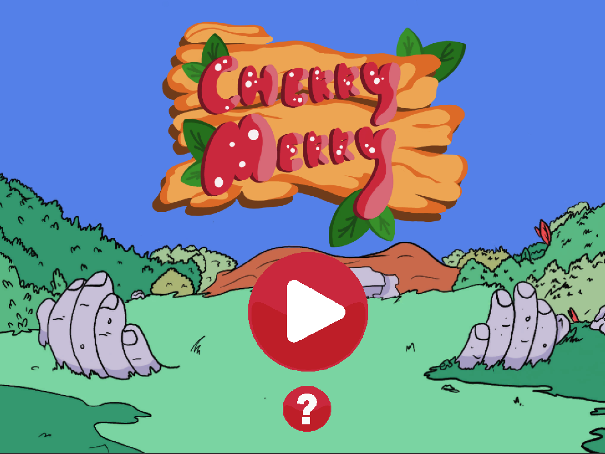
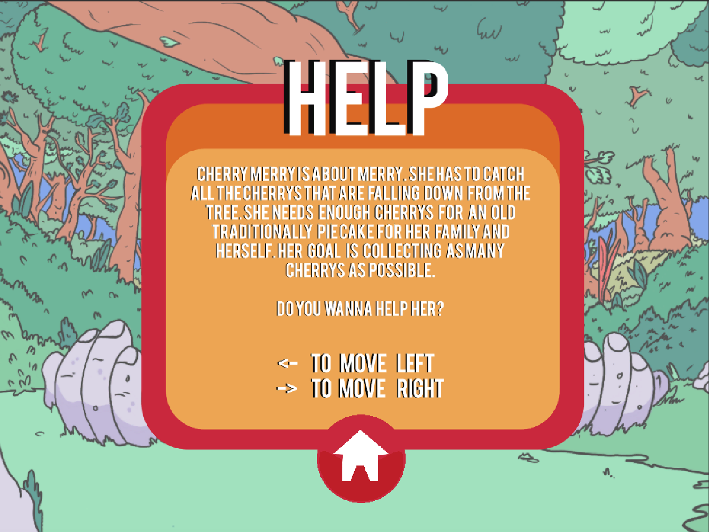
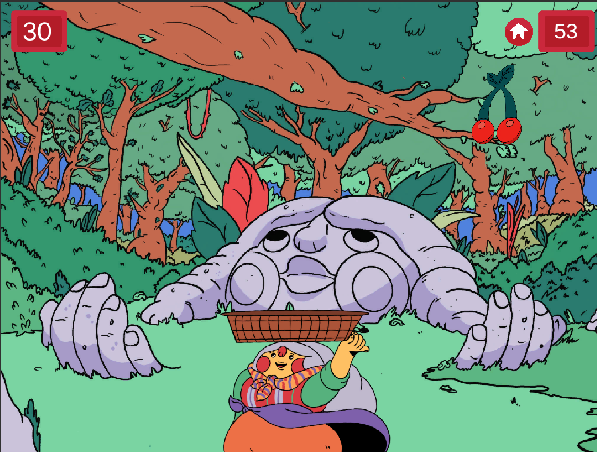
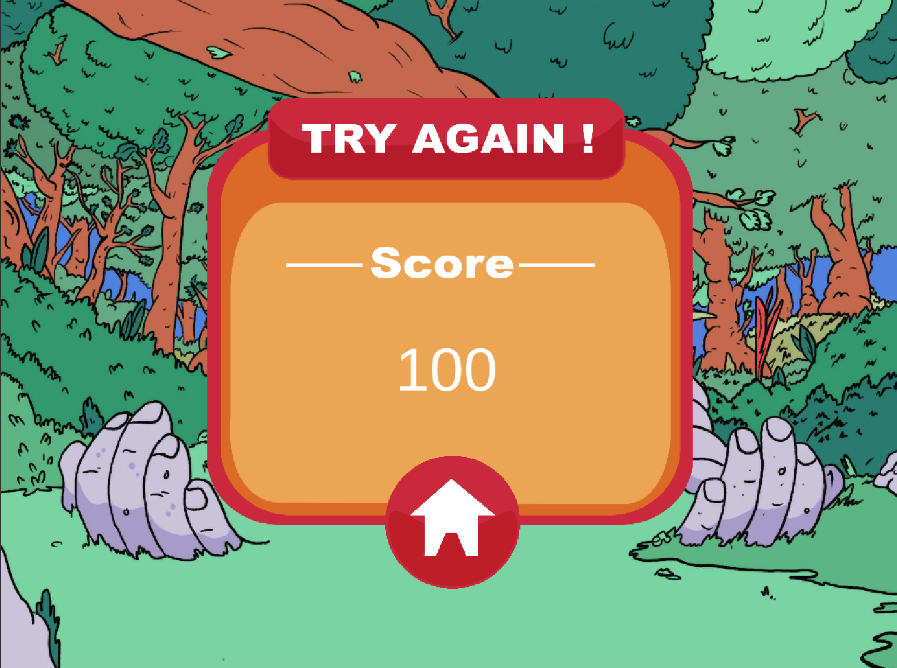

# MiniGame1-lmartinusic

<h5>Progress:</h5> 100%

<h5>Development Platform</h5>

-OS: macOS Mojave Version 10.14.3

-Unity: Version 2018.2.14f1

-Visual Studio Code: Version 1.33.0 

-Scripting Runtime Version: .NET 3.5 Equivalen

-API Compatibility Level: .NET 2.0 Subs

-Target Platform: WebGL (Resolution: 1024x768)

-Controles: arrow key left, arrow key right, mouse click (in menu)

<h5>Resources:</h5>

All imagery by Leo Martinusic, feel free to use

TextMeshPro (TMP) is needed when opening the Unity Project!

<h5>Third Party Material:</h5>

https://www.noob-programmer.com/unity3d/countdown-timer/

<h5>Trailer for the Game:</h5>

https://youtu.be/izpOXNe217g

<h5>Erstes Mini Game</h5>

The 2D game Cherry Mary is about a character called Mary. She has to catch all the Cherrys that
are falling down from the tree. She needs enough cherrys for an old traditionally pie cake for
her Family and herself. Her goal is collecting as many cherrys as possible.

<h5>Concept</h5>

<h5>Screenshots</h5>

<h5>Limitations:</h5> This Game is very simple. There is no stimulation for the user to play the game longer than a minute.
Beautify Code in Visual Studio Code not possible

<h5>Lessons Learned</h5>

- SceneLoader

- Player Movement left, right (x-axis)

- How to set up a game

- RandomGenerator

- Timer

- Score

Copyright by Leo Martinusic, 2019

